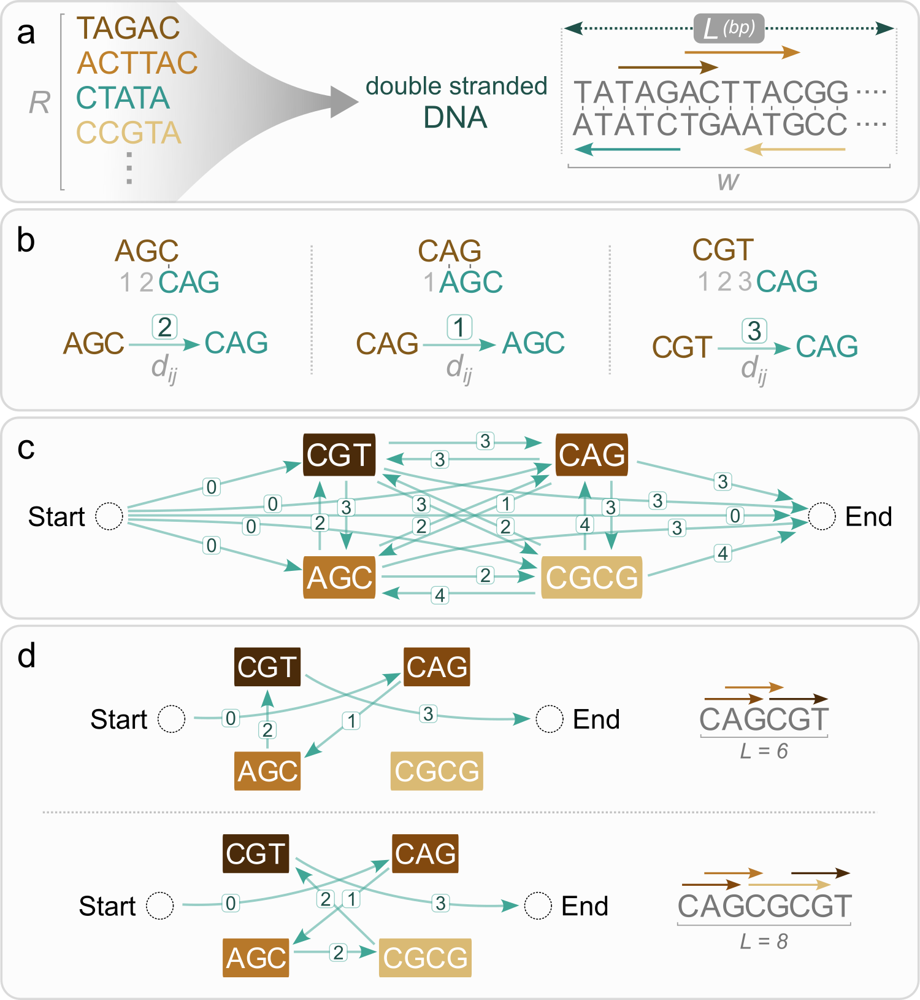

# dense-arrays

**dense-arrays** is a library for designing double-stranded nucleotide sequences with densely packed DNA-protein binding sites, which we name the nucleotide String Packing Problem (SPP), related to the classical Shortest Common Superstring problem in theoretical computer science.

For more detailed documentation, please visit our [documentation site](https://dunloplab.gitlab.io/dense-arrays).



*Formulation of the nucleotide String Packing Problem (SPP) as an Orienteering Problem (OP). For more details, see the [associated paper](https://journals.plos.org/ploscompbiol/article?id=10.1371/journal.pcbi.1012276).*

## Installation

1. **(Optional but Recommended) Create a Conda Environment**  
   Create and activate a new environment:
   ```bash
   conda create -n dense-arrays python
   conda activate dense-arrays
   ```

2. **Install the Package**  
   Use pip to install:
   ```bash
   pip install .
   ```

## Simple Usage

Here's an example that demonstrates how to use **dense-arrays**:

```python
import dense_arrays as da

# Define a list of nucleotide motifs and initialize the optimizer with a target sequence length.
opt = da.Optimizer([
    "ATAATATTCTGAATT",
    "TCCCTATAAGAAAATTA",
    "TAATTGATTGATT",
    "GCTTAAAAAATGAAC",
    "TGCACTAAAATGGTGCAA",
], sequence_length=30)

# Find and print the optimal solution.
best = opt.optimal()
print(f"Optimal solution, score {best.nb_motifs}")
print(best)

# List and print all possible solutions.
print("List of all solutions")
for solution in opt.solutions():
    print(f"Solution with score {solution.nb_motifs}:")
    print(solution)
```

## Solver Backends

The methods `Optimizer.optimal` and `Optimizer.solutions` allow you to specify a solver backend. They accept any solver supported by `ortools`. The available options include:

- `"CBC"` (default)
- `"SCIP"`
- `"GUROBI"`
- `"CPLEX"`
- `"XPRESS"`
- `"GLPK"`
