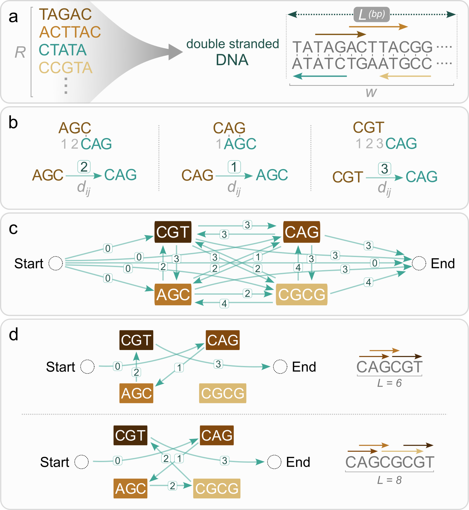

# dense-arrays

[](https://gitlab.com/dunloplab/dense-arrays/-/pipelines)
[](https://dunloplab.gitlab.io/dense-arrays)

**dense-arrays** is a library for designing double-stranded nucleotide sequences with densely packed DNA-protein binding sites, which we name the nucleotide String Packing Problem (SPP), related to the classical Shortest Common Superstring problem in theoretical computer science.

For more detailed documentation, please visit our [documentation site](https://dunloplab.gitlab.io/dense-arrays).



*Formulation of the nucleotide String Packing Problem (SPP) as an Orienteering Problem (OP). For more details, see the [associated paper](https://journals.plos.org/ploscompbiol/article?id=10.1371/journal.pcbi.1012276).*

---

### Installation

From the repo root:

```bash
uv sync --extra dev
```

This creates a local `.venv` and installs dev tools (pytest/ruff).

If you prefer pip:

```bash
pip install .
```

---

### Usage modes

Use **dense-arrays** either via the CLI for quick runs or the Python API for scripting.

CLI:

```bash
dense-arrays optimize --motifs-file motifs.txt --length 30 --strands double
dense-arrays solutions --motifs-file motifs.txt --length 30 --max-solutions 5 --diverse
```

Motifs file format: one motif per line (blank lines and `#` comments ignored). If no motif can fit within the requested length, the CLI exits non-zero with an explicit error; in Python, `Optimizer.optimal()` raises a `ValueError`.

Python API:

```python
import dense_arrays as da
import dense_arrays.sequence as seq

motifs = [
    "ATAATATTCTGAATT",
    "TCCCTATAAGAAAATTA",
    "TAATTGATTGATT",
    "GCTTAAAAAATGAAC",
    "TGCACTAAAATGGTGCAA",
]

opt = da.Optimizer(motifs, sequence_length=30)
best = opt.optimal()
# Best (highest score) solution.
print(best)

# Enumerate all solutions in decreasing score order.
for solution in opt.solutions():
    print(solution)

print("Shift metric:", seq.shift_metric("ATGCATTA", "CATTATG"))
```

Constraints (promoter/regulator/side bias) must be configured before calling `optimal()` or `solutions()`. To change constraints, create a new `Optimizer`.

Regulator constraints (optional, solver-level):

```python
regulators = ["R1", "R1", "R2", "R3", "R4"]
opt.add_regulator_constraints(regulators, min_required_regulators=2)
```

---

### Solver Backends

The methods `Optimizer.optimal` and `Optimizer.solutions` allow you to specify a solver backend. They accept any solver supported by `ortools`. The available options include:

- `"CBC"` (default)
- `"SCIP"`
- `"GUROBI"`
- `"CPLEX"`
- `"XPRESS"`
- `"GLPK"`

---

### Development

Install dev tools and enable pre-commit hooks:

```bash
uv sync --extra dev
uv run pre-commit install
```

Run the full hook suite locally:

```bash
uv run pre-commit run --all-files
```
