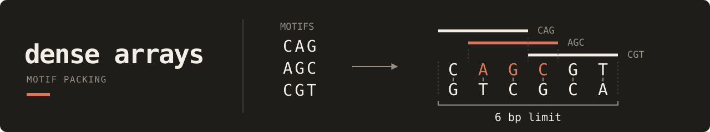

# Dense Arrays

Fit more DNA motifs into a short sequence by sharing compatible bases.
Dense Arrays returns the selected motifs and their positions. Start with four
16-base motifs that fit into a 40-base array, then add requirements or inspect
the arrangement through playback.

## Start with an array

[Run the first example](quickstart.md) to create the sequence and read its
offsets. The [packing method](method.md) explains how overlaps save space,
from the motif library to the selected arrangement. [Watch its playback](playback.md#watch-four-overlapping-motifs)
to follow the same placements across the finished sequence.

## Choose the next task

| Task | Read |
| --- | --- |
| Require motif groups or positional relationships | [Constraints](constraints.md) |
| Render saved placements as images or video | [Playback](playback.md) |
| Look up a command, option, or failure | [CLI reference](reference/cli.md) |
| Use the Python interfaces | [API reference](api.md) |

## Integrate or contribute

- [Architecture](architecture/README.md): code owners and data flow.
- [Playback contract](architecture/solution-playback.md): coordinates, schemas,
  reconstruction, and producer handoffs.
- [Update an existing caller](migration.md): input and integration changes.
- [Development](development.md): local verification and documentation builds.

For the published formulation and citation, see the
[method and associated paper](method.md#paper-and-citation).
