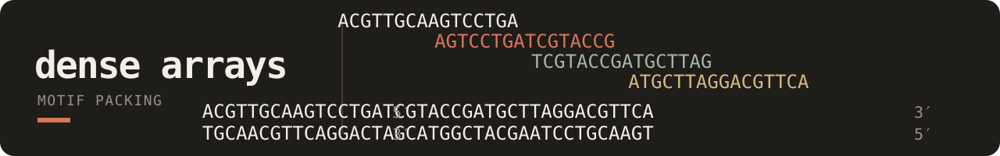

# Dense Arrays

Design nucleotide sequences with densely packed DNA-protein binding sites.
Prepare input pools, generate libraries under your constraints, and inspect
sequences with their recorded site positions and orientations. Python and the
command line use the same operations.

## Start here

[Install Dense Arrays](installation.md), then [create your first array](quickstart.md).
To [generate a saved library](library-workflow.md), use the
[source workflow installation](installation.md#use-the-library-workflow).
For a larger table-based workflow with multiple design combinations, follow
[the curated binding-site example](library-workflow/curated-example.md).

## Prepare parts

| Task | Guide |
| --- | --- |
| Read binding sites from CSV, TSV, Excel or Parquet | [Part tables](library-workflow/tables.md) |
| Sample motif models, choose windows and retain candidates | [Part preparation](library-workflow/preparation.md) |
| Generate background under GC and forbidden-pattern constraints | [Background parts](library-workflow/background.md) |
| Understand motif inputs, scoring units and thresholds | [Motif scoring](reference/motif-scoring.md) and [windows](reference/motif-windows.md) |
| Inspect preparation yield and selection evidence | [Preparation quality](library-workflow/preparation-quality.md) |

## Generate libraries

| Task | Guide |
| --- | --- |
| Generate and verify a saved collection | [Saved libraries](library-workflow.md) |
| Set positional or motif-group constraints on an optimizer | [Constraints](constraints.md) |
| Combine requirements and assign per-combination targets | [Design matrices](library-workflow/matrices.md) |
| Choose exact or greedy packing and part-use preferences | [Packing search](library-workflow/search.md) |
| Sample candidate batches and control retries | [Batch sampling](library-workflow/batches.md) |
| Set preparation, solver and inspection limits | [Resource limits](library-workflow/resources.md) |
| Continue an interrupted run | [Recovery](library-workflow/recovery.md) |
| Revise a request, compare plans or extend a library | [Revision and extension](library-workflow/extension.md) |

## Inspect and share results

| Task | Guide |
| --- | --- |
| Choose a summary, diagnostic, figure or export | [Result views](reference/outputs.md) |
| Save requests, plans and compare quality reports | [Reports and reusable requests](library-workflow/handoffs.md) |
| Select a fixed-size panel with reproducible membership | [Library selection](library-workflow/selection.md) |
| Share verified records independently of original files | [Portable bundles](library-workflow/bundles.md) |
| Render placements as stills or animations | [Playback](playback.md) |

## Reference and contribution

[Python interfaces](api.md) · [CLI options](reference/cli.md) ·
[Packing method and paper](method.md) · [Caller compatibility](migration.md)

For implementation work, use the [code map](architecture/README.md),
[workflow contracts](architecture/library-workflow/index.md), and
[development checks](development.md). [Documentation guidance](development/documentation.md)
explains page ownership, examples and module attribution.
