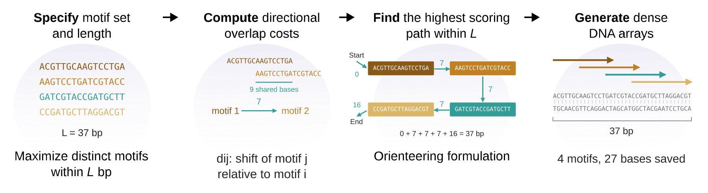

# How motifs share sequence space

Placing motifs end to end spends one base for every base in the library.
Compatible overlaps reduce that cost: a suffix of one motif can also serve as
the prefix of the next. Dense Arrays uses these overlaps to select motifs and
an order that fits the requested length limit.

## Follow the worked example

The [first-array tutorial](quickstart.md) supplies four 16-base motifs. The
first two share the eight-base string `AGTCCTGA`:

```text
ACGTTGCAAGTCCTGA
        AGTCCTGATCGTACCG
```

Their combined length is 24 bases. The third and fourth motifs each share
eight bases with the preceding motif, adding eight bases apiece. All four
therefore fit in `16 + 8 + 8 + 8 = 40` bases, compared with 64 bases placed end
to end:

```text
ACGTTGCAAGTCCTGATCGTACCGATGCTTAGGACGTTCA
```

The process figure follows the same library through four stages: specify the
motifs and length limit, compute directional overlap costs, select a path,
and read the packed sequence.

[](assets/motif-packing-process.svg)

[Open the full-size figure](assets/motif-packing-process.svg) to read the sequence labels.

*Motif packing from inputs to sequence.* Process figure adapted by Eric J.
South for this worked example. The [paper](https://doi.org/10.1371/journal.pcbi.1012276)
reports Gurobi experiments packing 20–100 binding sites into 50–300 bp in
0.05–10 seconds.

## From overlaps to an optimization problem

Dense Arrays formulates the nucleotide String Packing Problem as an
Orienteering Problem. Motifs become graph nodes, and directed transitions
account for the sequence span needed to place one motif after another.
Each edge records the shift between motif starts; the final edge accounts
for the last motif's length.
Reversing their order can change the overlap and therefore the cost. An
integer optimization solver selects a path within the length limit.
Double-strand optimization includes reverse-complement orientations as well.

In the shown orientation, the first motif occupies 16 bases. The three
subsequent transitions each add eight bases, producing starts at 0, 8, 16, and
24. A result in this orientation retains these input-order offsets.

The exact model counts selected entries along its path. A motif that happens
to occur inside another selected motif does not receive an additional
placement through the overlap metric. For example, `ACGTTGCAAGTCCTGA` contains
`TTGCAAGTCC`, but a 16-base limit gives one selected entry in the exact model.
Repeated identical strings also require distinct path placements. Use the
returned motif count and offsets when reporting selected entries; a search
for all substring matches answers a different question.

## Add requirements or inspect the result

[Constraints](constraints.md) can require positional relationships or motif
groups, and side biases can favor left or right positions. Configure these
requirements before solving.

[Playback](playback.md) shows saved placements across the finished sequence.
Its order is reconstructed from coordinates. To translate an optimizer result
or another producer's records into playback input, follow the
[record and ownership contract](architecture/solution-playback.md).

## Paper and citation

The paper develops the formulation, benchmarks, and extensions, with the
original full graph and alternative solutions:

Andreani V, South EJ, Dunlop MJ (2024). Generating information-dense promoter
sequences with optimal string packing. *PLOS Computational Biology* 20(7):
e1012276. [doi:10.1371/journal.pcbi.1012276](https://doi.org/10.1371/journal.pcbi.1012276).

When citing software results, also record the package version or commit used.
